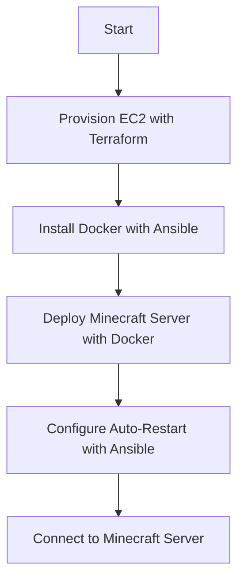

# Automating a Minecraft Server Setup on AWS

## Background

This tutorial will guide you through automating the provisioning, configuration, and deployment of a Minecraft server on AWS. We will use Terraform for infrastructure provisioning, Ansible for configuration management, and Docker for container management. By the end, you will have a fully automated pipeline that sets up an EC2 instance, installs Docker, deploys a Minecraft server container, and ensures the server restarts automatically on instance reboot.

---

## Requirements

Before starting, ensure you have the following tools installed/available:
    - An AWS Account (and associated credentials that allow you to create resources)
    - AWS CLI (version 2.15+)
    - Terraform (version 1.8+)
    - Ansible (version 2.17+)

### Setting Up and Installing the Necessary Tools

- **AWS CLI**
    1. **Install AWS CLI**: Follow the installation guide [here](https://docs.aws.amazon.com/cli/latest/userguide/getting-started-install.html)
    2. **Configure AWS CLI**: Enter the following command in your terminal:
        ```sh
        aws configure
        ```
        You will be prompted to enter your AWS Access Key, Secret Access Key, region, and output format. If you are an IAM or AWS Account Root User, these are the only credentials you will need to set to access your AWS console. If you are using an AWS tool that generates session tokens, be sure to set that as well by typing the following command in your terminal (replace `value` with your session token):
            ```sh
            aws configure set aws_session_token "<value>"
            ```

- **Terraform**
    1. **Install Terraform**: Follow the installation guide [here](https://developer.hashicorp.com/terraform/tutorials/aws-get-started/install-cli)

- **Ansible**
    1. **Install Ansiblle**: Follow the installation guide [here](https://docs.ansible.com/ansible/latest/installation_guide/intro_installation.html)

### Setting AWS Credentials as Environment Variables

- To allow Terraform and Ansible to interact with AWS (eg. authenticating the Terraform AWS provider), set your AWS credentials as environment variables as shown below (note: this step is only required for IAM or account root users).
    ```sh
    export AWS_ACCESS_KEY_ID=your_access_key_id
    export AWS_SECRET_ACCESS_KEY=your_secret_access_key
    ```

---

## Pipeline Overview

1. **Provision Infrastructure with Terraform**: Create an EC2 instance and configure networking.
2. **Configure Server with Ansible and Docker**: Install Docker and deploy the Minecraft server.
3. **Ensure Auto-Restart with Ansible**: Configure the server to restart automatically on instance reboot.

--- 

## Pipeline Diagram



---

## Step-by-Step Instructions

1. Provision Infrastructure with Terraform

