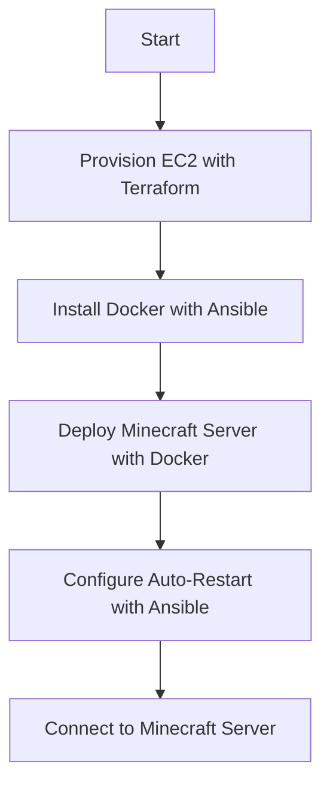

# Automating a Minecraft Server Setup on AWS

## Background

This tutorial will guide you through automating the provisioning, configuration, and deployment of a Minecraft server on AWS. We will use Terraform for infrastructure provisioning, Ansible for configuration management, and Docker for container management. By the end, you will have a fully automated pipeline that sets up an EC2 instance, installs Docker, deploys a Minecraft server container, and ensures the server restarts automatically on instance reboot.

---

## Requirements

Before starting, ensure you have the following tools installed/available:
    - An AWS Account (and associated credentials that allow you to create resources)
    - AWS CLI (version 2.15+)
    - Terraform (version 1.8+)
    - Ansible (version 2.17+)

### Setting Up and Installing the Necessary Tools

- **AWS CLI**
    1. **Install AWS CLI**: Follow the installation guide [here](https://docs.aws.amazon.com/cli/latest/userguide/getting-started-install.html)
    2. **Configure AWS CLI**: Enter the following command in your terminal:
        ```sh
        aws configure
        ```
        You will be prompted to enter your AWS Access Key, Secret Access Key, region, and output format. If you are an IAM or AWS Account Root User, these are the only credentials you will need to set to access your AWS console. If you are using an AWS tool that generates session tokens, be sure to set that as well by typing the following command in your terminal (replace `value` with your session token):
            ```sh
            aws configure set aws_session_token "<value>"
            ```

- **Terraform**
    1. **Install Terraform**: Follow the installation guide [here](https://developer.hashicorp.com/terraform/tutorials/aws-get-started/install-cli)

- **Ansible**
    1. **Install Ansiblle**: Follow the installation guide [here](https://docs.ansible.com/ansible/latest/installation_guide/intro_installation.html)

### Setting AWS Credentials as Environment Variables

- To allow Terraform and Ansible to interact with AWS (eg. authenticating the Terraform AWS provider), set your AWS credentials as environment variables as shown below (note: this step is only required for IAM or account root users).
    ```sh
    export AWS_ACCESS_KEY_ID=your_access_key_id
    export AWS_SECRET_ACCESS_KEY=your_secret_access_key
    ```

---

## Pipeline Overview

1. **Provision Infrastructure with Terraform**: Create an EC2 instance and configure its network security settings.
2. **Configure Server with Ansible and Docker**: Install Docker on the EC2 and deploy the Minecraft server.
3. **Ensure Auto-Restart with Ansible**: Configure the server to restart automatically on instance reboot.

--- 

## Pipeline Diagram



---

## Execution Tutorial

After following the setup requirements above and cloning this github repository on your desired execution machine, we can automatically run the provisioning/configuration scripts by executing the `deploy.bash` file that's provided. All the commands that we need to deploy our project are located in this file. To execute this *bash* script, type the following commands in your execution machine's terminal (in the same directory where your `deploy.bash` file is located):
    ```sh
    chmod +x deploy.bash
    bash deploy.bash
    ```

Here is the full list of commands we will run in our *bash* script along with brief explanations of what each of them do:
    ```bash
    #!/bin/bash

    # Navigate to the Terraform directory and apply the preset configuration
    cd terraform
    terraform init
    terraform apply -auto-approve

    # Extract the public IP of the newly created EC2 instance
    instance_ip=$(terraform output -raw instance_public_ip)

    # Retrieve the private key and save it to a file
    terraform output -raw private_key_pem > ../ansible/minecraft_key.pem
    chmod 600 ../ansible/minecraft_key.pem

    # Update the Ansible inventory file with the instance IP
    echo "[minecraft]" > ../ansible/inventory.ini
    echo "$instance_ip" >> ../ansible/inventory.ini

    # Navigate to the Ansible directory and run the playbook against our managed node (the EC2 instance) to configure the minecraft server
    cd ../ansible
    ansible-playbook -i inventory.ini --private-key minecraft_key.pem playbook.yml
    ```

---

## Connect to the Minecraft Server with a Minecraft Client

1. Open Minecraft on any host machine and navigate to the **Multiplayer** Section.
2. Click on **Add Server**
3. Enter your EC2 instance's public IP address (located on your AWS EC2 instances dashboard) in the **Server Address** field.
4. Click **Done** and then select your server to join.

(Alternatively, to verify client connections can be made to your instance's public IP address (i.e., your Minecraft server address), run this command in your terminal: `nmap -sV -Pn -p T:25565 <instance_public_ip>`)

By following these steps, you have automated the process of setting up a Minecraft server on AWS. This approach ensures that the server is configured consistently and can be easily replicated or modified.

---

## References
- 